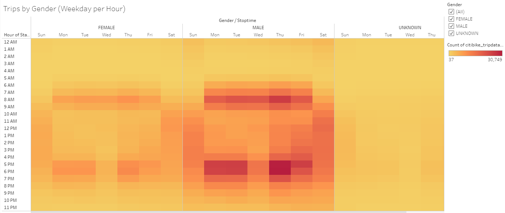
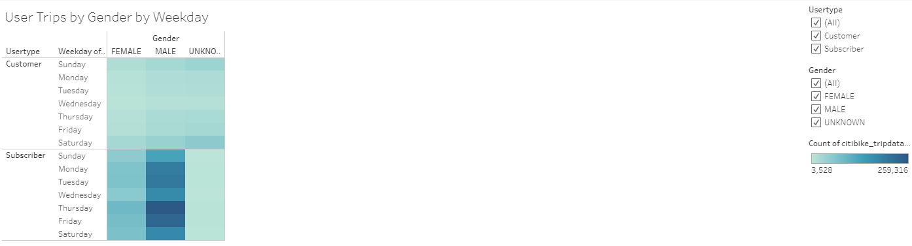
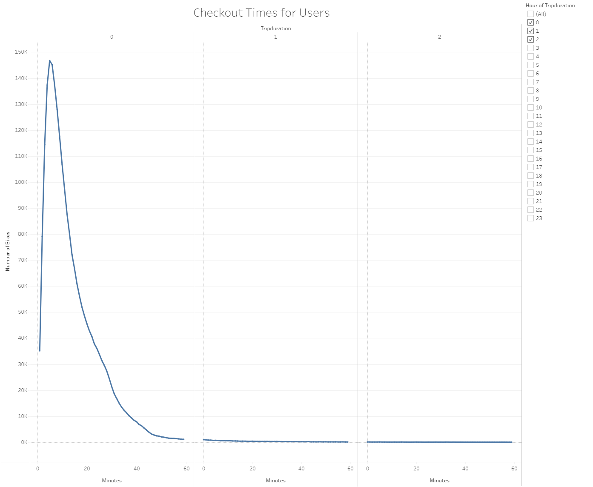
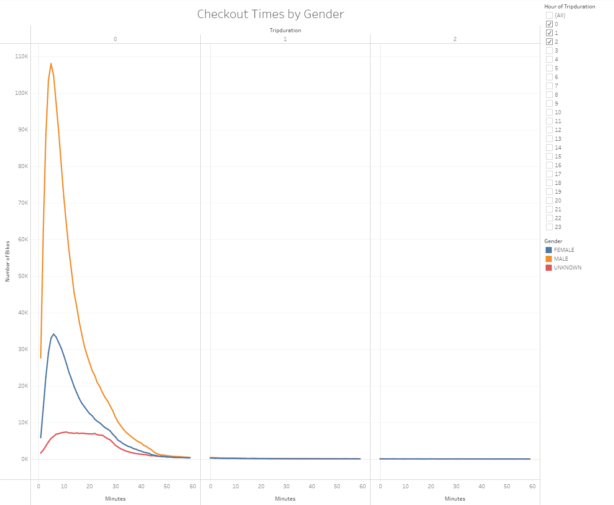
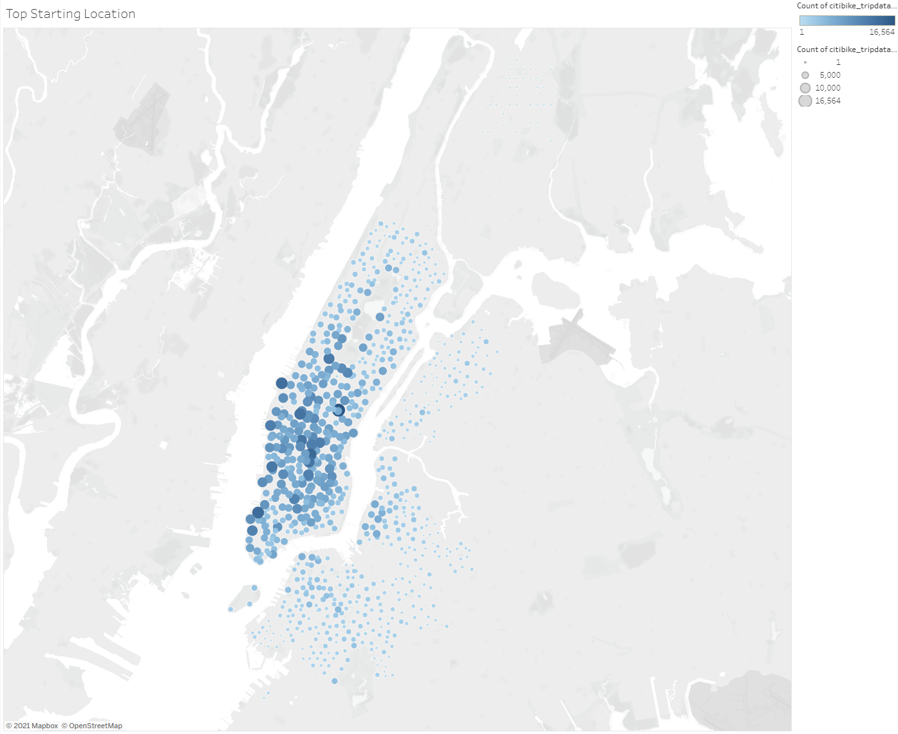
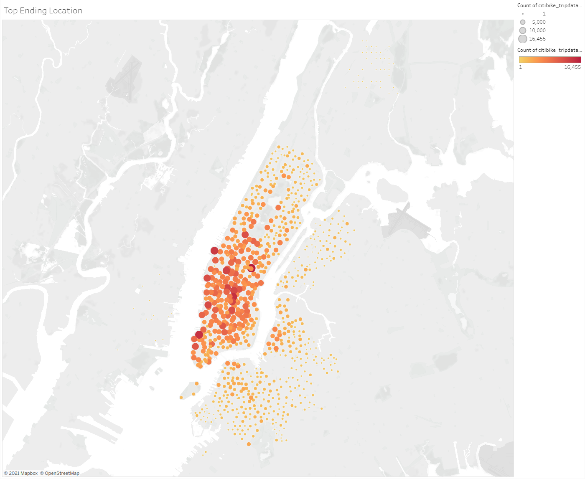

# NYC Citibike Analysis Using Tableau

## Overview of Bike Trip Analysis

### Purpose
The purpose of this bike trip analysis was to present data on the NYC Citibike bike-sharing program to convince investors that a bike-sharing program in Des Moines is a solid business proposal.

The Tableau Story and visualizations can be found here: [NYC Citibike Analysis](https://public.tableau.com/profile/michael.leggett#!/vizhome/NYCCitibikeAnalysis_16219136477410/NYCCitibikeAnalysis)

## Results

This chart shows that peak usage hours are 8-9AM and 5-6PM as these times are typical work commute hours. This chart also shows that the best time for bike maintenance is between 2-4AM.

This heatmap further demonstrates that peak bike usage is during typical work commute hours. The bikes are more evenly used throughout the morning and afternoon on Saturday's, probably due to tourists and sightseeing.

This heatmap shows similar trends but is broken down by gender. As we can see, males use bikes significantly more than females. However, usage times between males and females is about the same.

This heatmap shows that subscribers use the bikes much more often than customers. This shows that local people use the bikes at a significantly higher rate than tourists as locals would be more likely to subscribe and tourists would only use the bikes during their stay.

This line chart shows that a vast majority of rides are between 5-6 minutes in duration. This means that most people use the bikes to get from point A to point B such as for work commute, rather than leisure riding like for sightseeing.

This line chart further shows that males predominantly use the bikes while also maintaining the trend that most bike rides are between 5-6 minutes.

This map shows that a majority of starting locations are in the downtown area, as this area has the most population density and the most commuters. This would also be the area most tourists would be.

This ending locations are very similar to the starting locations, further demonstrating that the greatest usage are in the most population dense areas.

## Summary
Des Moines would be a great location for a bike-sharing program. Based on the data from the NYC bike-sharing program, we can see that most users are local and will be willing to subscribe to the service, and that many presumably use the bike-sharing program for inner city commute. For future analysis, it would be useful to have bike usage data for each month of the year to see which months are the most and least popular and see how many subscribers and customers use the bikes during the winter months. It would also be useful to have weather data over the course of a year to see how much weather affects bike usage.
