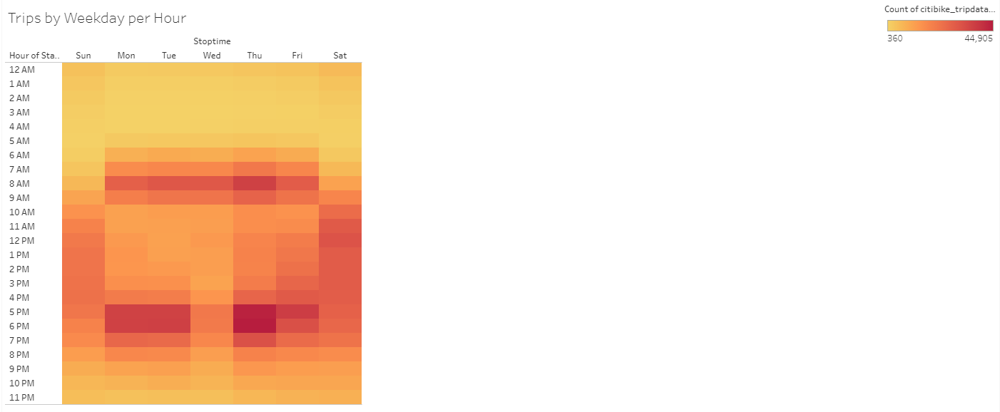

# NYC Citibike Analysis Using Tableau

## Overview of Bike Trip Analysis

### Purpose
The purpose of this bike trip analysis was to present data on the NYC Citibike bike-sharing program to convince investors that a bike-sharing program in Des Moines is a solid business proposal.

The Tableau Story and visualizations can be found here: [NYC Citibike Analysis](https://public.tableau.com/profile/michael.leggett#!/vizhome/NYCCitibikeAnalysis_16219136477410/NYCCitibikeAnalysis)

## Results

This chart shows that peak usage hours are 8-9AM and 5-6PM as these times are typical work commute hours. This chart also shows that the best time for bike maintenance is between 2-4AM.

This heatmap further demonstrates that peak bike usage is during typical work commute hours. The bikes are more evenly used throughout the morning and afternoon on Saturday's, probably due to tourists and sightseeing.

